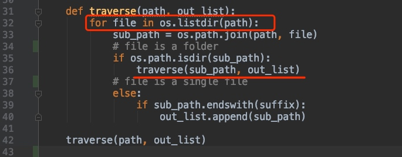

# Task2_explanation
## Problem description
For this problem, the goal is to write code for finding all files under a directory (and all directories beneath it) that end with ".c"

# Solution
This is a very classic recursion problem.The structure of the *testdir* is similar to a tree. And I use Depth first search algorithm to solve the problem.
The initial input path can be regarded as a root node. We firstly get root node's sub-child through the for loop. And then, for each sub-child node, we traverse recursively until it's not a path any more. Since the file is not path now, we judge if it's end with our ideal suffix and append it to the list() structure: out_list.

-------

**Time complexity:**
Time  complexity is consumed by the DFS algorithm. We call the for loop on the root path and then recursively traverse  it's child path with for loop again and again. **Big O equals to** $O(n^2)$

**Space complexity:**
If each time we call traverse() method, it will take O(m) space for storing list() structure: `os.listdir(path)`. Assert the finite depth of recursion is n, then 
  **Big O equals to** $O(n*m)+ O(l)$
  ps:O(l) is the out_list each time we store the ideal results.