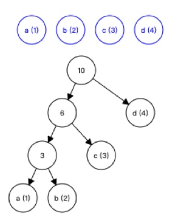
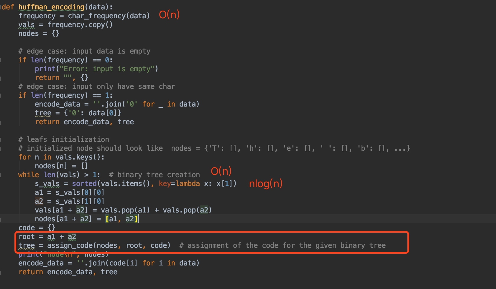
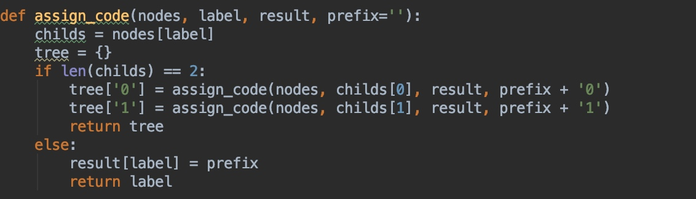
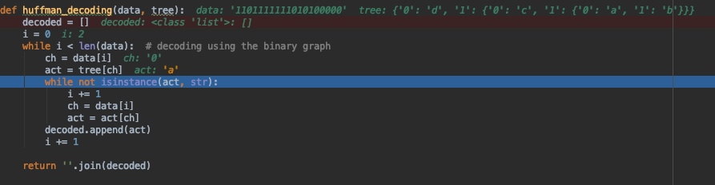

# Task3_explanation
## Problem description
A Huffman code is a type of optimal prefix code that is used for compressing data. The Huffman encoding and decoding schema is also lossless, meaning that when compressing the data to make it smaller, there is no loss of information.

The Huffman algorithm works by assigning codes that correspond to the relative frequency of each character for each character. The Huffman code can be of any length and does not require a prefix; therefore, this binary code can be visualized on a binary tree with each encoded character being stored on leafs. For visualize how Huffman algorithm works, an interaction example can be found [here](https://people.ok.ubc.ca/ylucet/DS/Huffman.html).
## Solution 
Firstly, we need to understand the purpose of Huffman encoding: to save physical memory. But how to save memory? Instead of allocate each char with same memory size(eg :8bits), Huffman encode the char according to their frequency. A more frequent seen char will have less bits.(appear at root of the tree), and rare seen char will have more bits(appear at bottom of the tree).

*Here's an example.* Assume our input str is "abbcccdddd", then a tree will build like this. The blue circle count the  frequency of each char. 

Time complexity:
The whole time complexity can be dived in to three part:
_Construct tree , Encode, Decode_
- Part1: Prepare tree nodes.   In this part, we will get the tree node structure for construct a binary tree in part2. nodes look like this `{'a': [], 'b': [], 'c': [], 'd': [], 'ab': ['a', 'b'], 'cab': ['c', 'ab'], 'dcab': ['d', 'cab']}`
 

 

 **Big O equals to** $O(n)+ O(n)*O(nlogn)->O(n^2logn)$

- Part2: construct tree. 
given nodes structure from part1 and the initialized label 'dcba' we can make a binary tree now. In this part, BFS is used.
 **Big O equals to the time for BFS recursion** $O(n)=O(n^2)$

- part3 decode Huffman code
**Big O equals to  $O(n^2)$**

Total Time complexity **Big O equals to** $O(n^2logn)$
Space complexity **Big O equals to**$O(n)$