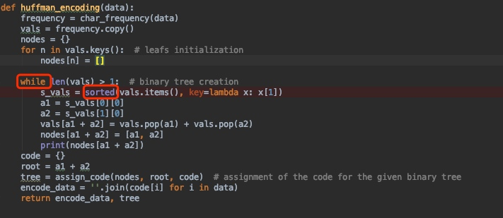

# Task3_explanation
Huffman_coding: I use binary tree to implement. 

Time complexity for while is $O(n)$
Time complexity for sort is $O(nlogn)$
Total Time complexity **Big O equals to** $O(n^2logn)$
Space complexity **Big O equals to**$O(n)$