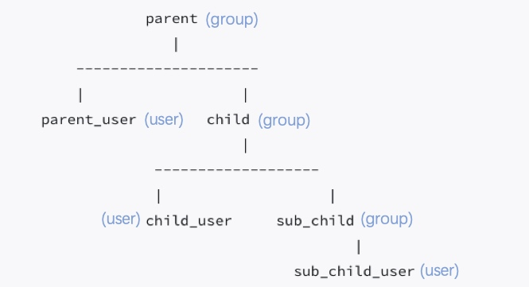

# Task4_explanation
## Problem description
In Windows Active Directory, a group can consist of user(s) and group(s) themselves. We can construct this hierarchy as such. Where User is represented by str representing their ids.

## Solution
Here's an example how the problem looks like. We can see that the group may contain both sub_group and user. 

Depth First search is used in this task. The problem can be regarded as searching in a binary tree. Where method `add_group(self, group)` is the left child and method `add_user(self, user)` is the right child. If our searching user is in the the group user, we then return True. Else, we pick one of the sub_group user and go deeper (recursively) to see if the searching user is in that group.

Time complexity is equal to the DFS recursion and for loop..
**Big O equals to** $O(n^2)$

Space complexity is cost by traverse the sub group node.
 **Big O equals to** $O(n)$
