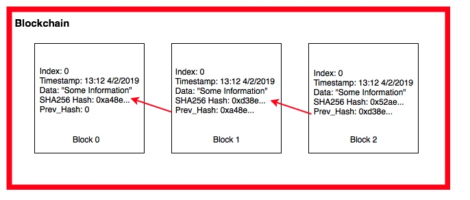

# Task5_explanation
## Problem description
A Blockchain is a sequential chain of records, similar to a linked list. Each block contains some information and how it is connected related to the other blocks in the chain. Each block contains a cryptographic hash of the previous block, a timestamp, and transaction data. For our blockchain we will be using a SHA-256 hash, the Greenwich Mean Time when the block was created, and text strings as the data.

## Solution 
Linked_list like structure is used for solving this problem. 
Each time we add a new block to the end of the block chain. If we have n blocks, this will take O(n) time to traverse from the head to the end.
Time complexity **Big O equals to** $O(n)$
Space complexity**Big O equals to** $O(n)$ (n is the size of the blocks in block chain)